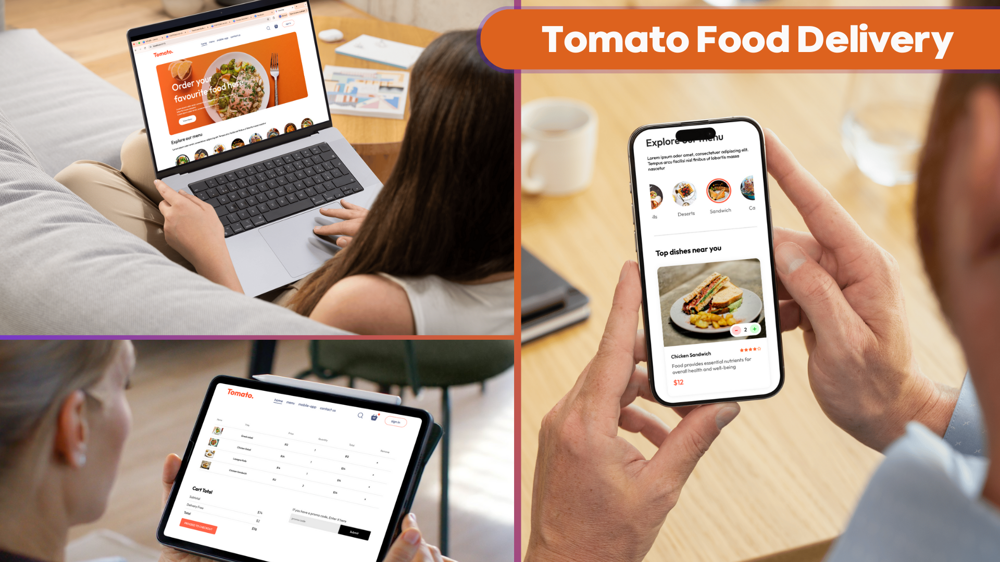
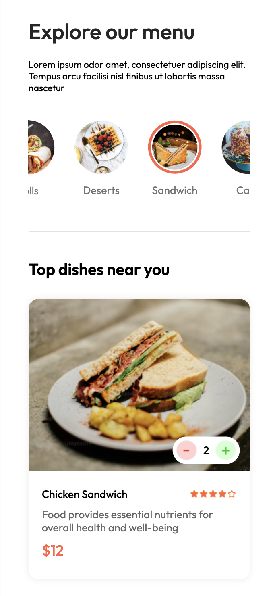
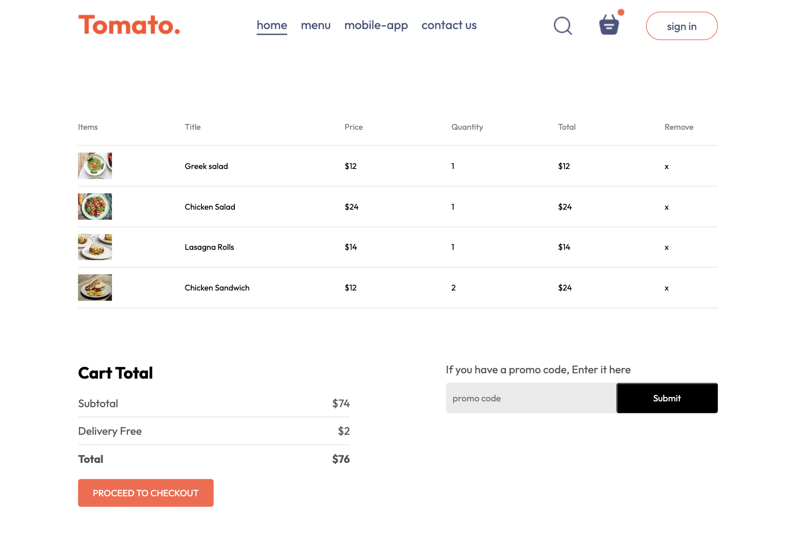

# 🍔 Food Delivery Web App (Frontend)
A responsive **Food Delivery web application** built with **React,** **JS** and **CSS**.  
Users can browse food categories, view trending menus nearby, and manage their cart with add/remove functionality.  

---
## ✨ Features
- 🔎 Search food by category  
- ⭐ View popular menus nearby  
- ➕➖ Add or remove items from the cart  
- 📱 Responsive design for desktop and mobile
  
---
## 🛠️ Tech Stack
- **React.js** – Component-based UI  
- **CSS** – Responsive design  
- **Context API** – Global state management (e.g. Cart)

---
## 📚 What I Learned
- Using **React Context API** for global state management  
- Organizing a **clean project structure** for scalability  
- Writing **clean, maintainable code** by learning from experienced developers  
- Applying responsive design principles with CSS

---

## 🚀 Getting Started

### 1. Clone the repository
```bash
git clone https://github.com/Nongkreem/food-delivery.git
cd food-delivery
```

### 2. Install and Run
```bash
npm install
npm run dev
```
---
## 📸 Screenshots

### Overview


### Hero Section (Desktop Viewport)


### Explore Menu Section (Smartphone Viewport)


### Cart Page (iPad/Tablet Viewport)


---
## 📖 Reference
[https://www.youtube.com/watch?v=9jRTo7ILxQc&list=PL5ZYAxh3sxBCsXk97yqldBJPDXH8gDIYH&index=7]
